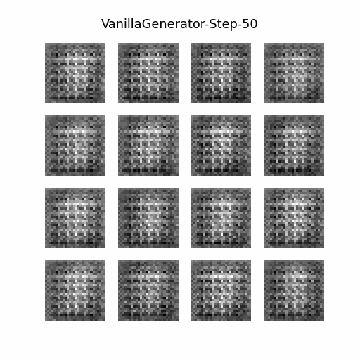

#  Generative Adversarial Networks(GAN) in TensorFlow 2.0

Tensorflow implementation of deep learning pipelines that are based on Generative Adversarial Networks.
Now it type of GAN is available such as:
* Vanilla GAN (Mnist)
* Vanilla GAN (Fashion Mnist)
* DCGAN (Planned)
* StyleGAN (Planned)

##  Prerequisites

##  Usage Example - Vanilla GAN for MNIST

 <b>Pre-trained models</b>
To test with an existing model:

    $ python3 run.py --exp=PRETRAINED  --gan_type=VANILLA_MNIST

 <b>Training models</b>
Or you can train by yourself

    $ python3 run.py --exp=TRAIN  --gan_type=VANILLA_MNIST

## Results

### Image generation
Vanilla GAN (MNIST)            |  Vanilla GAN (FASHION_MNIST)
:-------------------------:|:-------------------------:
  |  ...WIP...

## Monitoring model training
...WIP...

## References
1. [Generative Adversarial Networks](https://arxiv.org/abs/1406.2661)
1. [Deep Convolutional Generative Adversarial Network Tutorial in TensorFlow](https://www.tensorflow.org/beta/tutorials/generative/dcgan)